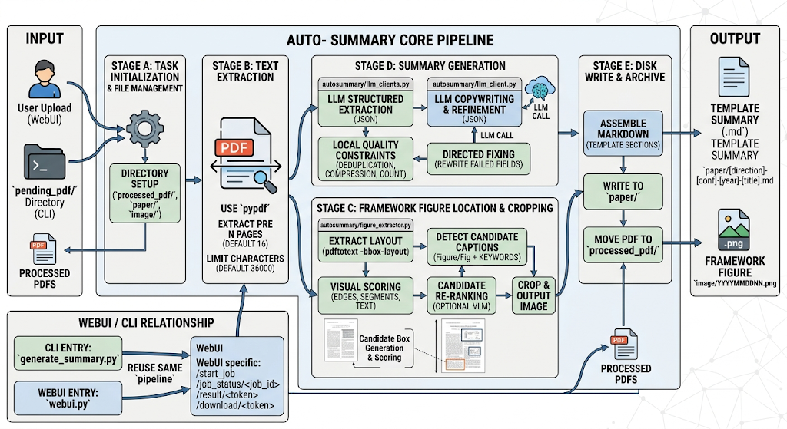

# Auto-Summary

## 项目介绍
配合 [Social-AI-Group](https://github.com/lucianma05-create/Social-AI-Group) 格式，`Auto-Summary` 用于自动生成论文摘要 Markdown。


技术工作流详见 [WORKFLOW.md](./WORKFLOW.md)。

核心能力：
- 上传/读取 PDF，自动提取正文与候选框架图
- 调用大模型生成结构化摘要并渲染为 `.md`
- 输出到 `paper/`，图像输出到 `image/`，原始 PDF 移动到 `已处理pdf/`
- 提供 CLI 与 WebUI 两种使用方式

WebUI 特性：
- 页面保留上传框 + Base URL/API Key/Model（可自定义并浏览器本地缓存）+ 分享人字段
- 进度条显示实时阶段状态
- 首页带“最近结果缓存区”，可回看和下载历史结果

---

## 文件树

```text
Auto-Summary/
├── generate_summary.py          # CLI 入口
├── webui.py                     # WebUI 入口 (Flask)
├── requirements.txt
├── README.md
├── templates/
│   ├── index.html               # 上传页 + 进度条 + 缓存区
│   └── result.html              # 结果渲染页
├── autosummary/
│   ├── __init__.py
│   ├── cli.py                   # CLI 主入口
│   ├── settings.py              # 参数与配置读取
│   ├── constants.py             # 常量定义
│   ├── text_utils.py            # 文本/文件名/质量约束工具
│   ├── llm_client.py            # LLM 调用与结构化抽取
│   ├── figure_extractor.py      # 框架图候选检测与裁剪
│   ├── summary_writer.py        # Markdown 组装
│   └── pipeline.py              # 主流程编排
├── 待处理pdf/
├── 已处理pdf/
├── paper/
└── image/
```

---

## 运行方式

### 1) 安装依赖

```bash
cd /data/user21300120/mmh/Auto-Summary
pip install -r requirements.txt
```

系统还需安装 `pdftoppm`（Poppler）。

### 2) 配置环境变量

```bash
export HAPPYAPI_API_KEY='你的apikey'
export HAPPYAPI_BASE_URL='https://happyapi.org/v1(api base url)'
export HAPPYAPI_MODEL='gpt-5.1-high(model name)'  # 可选，默认为 gpt-5.1-high
export SUMMARY_SHARER='你的名字'          # 可选，WebUI 可覆盖
export SUMMARY_NICKNAME='pd'            # 可选，全局昵称（英文），用于图片命名后缀
```

可选流程参数（不配则走默认）：

```bash
export SUMMARY_MAX_PAGES=16
export SUMMARY_SCAN_PAGES=30
export SUMMARY_MAX_CHARS=36000
export SUMMARY_TIMEOUT=180
export SUMMARY_RETRIES=3
export SUMMARY_USE_VLM_RERANK=1
export SUMMARY_VLM_TOP_K=3
```

说明：WebUI 默认按 `SUMMARY_USE_VLM_RERANK=1`（开启）运行以提升框架图选择准确率；如需优先速度可设为 `0`。

### 3) CLI 运行

```bash
python generate_summary.py
```

### 4) WebUI 运行

```bash
python webui.py
```

浏览器打开：`http://127.0.0.1:5050`

---

## 输出约定

- 摘要文件：`paper/[方向]-[会议]-[年份]-[标题].md`
- 图片命名：`image/YYYYMMDDNN[姓名缩写][昵称].png`
  - 示例：`2024010101mmhpd.png`
  - 其中 `昵称` 来自全局变量 `SUMMARY_NICKNAME`（英文/数字）
- 已处理 PDF：移动到 `已处理pdf/`
- 摘要模板结构与 `Social-AI-Group/Example.md` 对齐

本项目由NWPU Crowd-HMT-Lab Social-AI-Group 维护。
